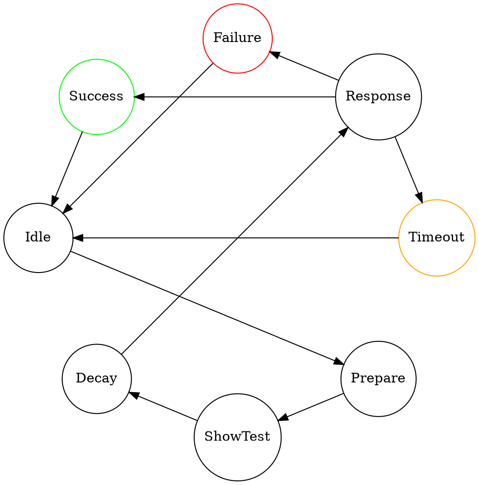

# DONALD 2021

# introduction

Donald-2021 is named after Donald Norman, one of the fathers of Interaction Design and is a short-term memory tester to be used in various applications.
The learning goal is to experience using hardware to gather quantitative user data for optimizing human-machine interaction and to determine a treshold for satisfactory performance for certain tasks.

Donald used to be a hardware device implemented as an Arduino, an AUAS electronic board, and a Raspberry Pi based device using 4 touch controls and a 12 color LED ring for visual feedback and display.

In course yar 2021 this was changed to a web application due to the corona pandemic.

## state machine

## data format
